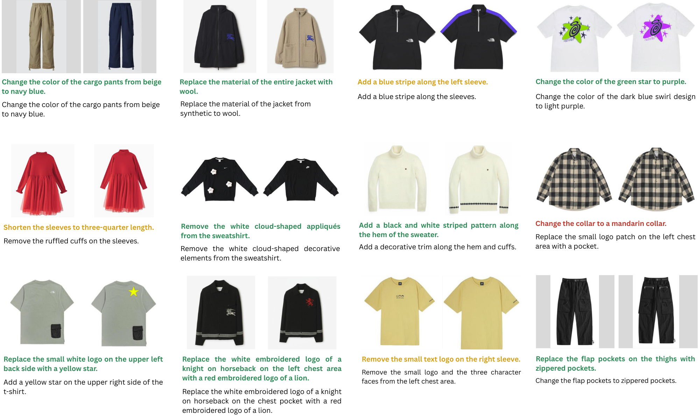
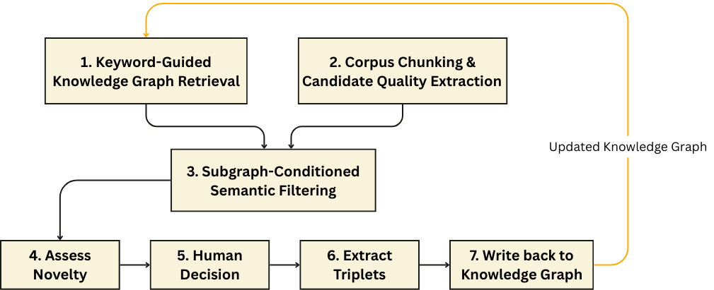
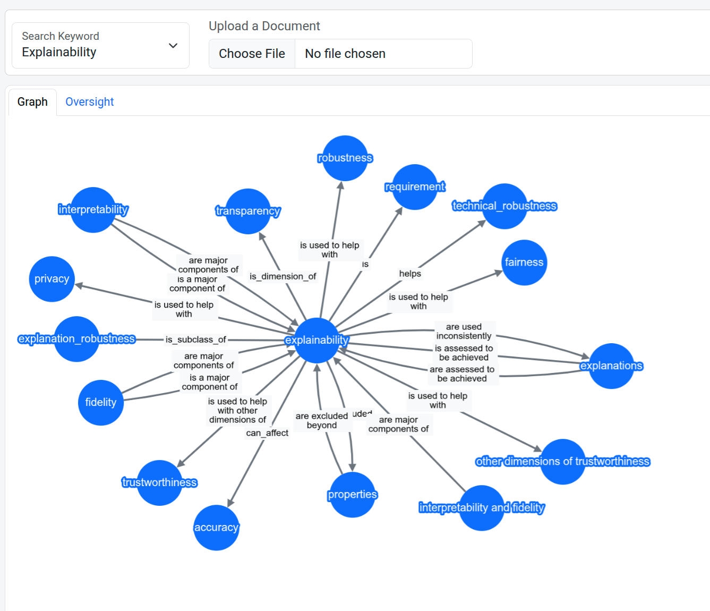
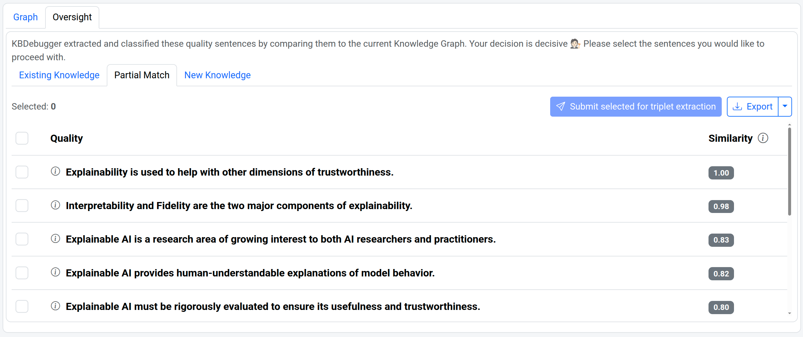
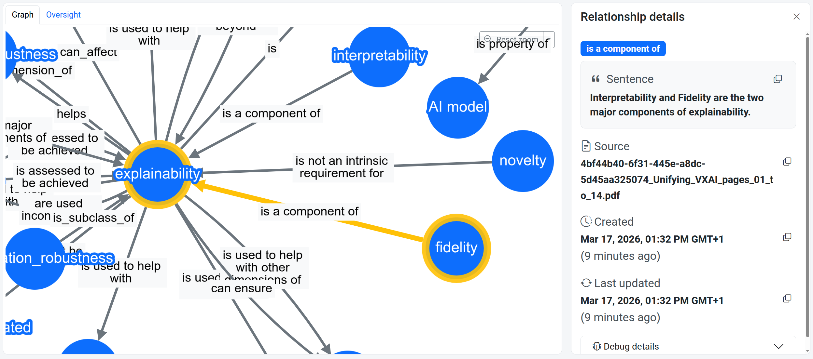

# Master's Research Projects — RPTU Kaiserslautern

**Faris Abu Ali** · M.Sc. Computer Science · RPTU Kaiserslautern-Landau  
Projects carried out at **DFKI Kaiserslautern** during Semester 4 (WiSe 2025–26)

---

## Projects Overview

| # | Project | Department | Supervisor(s) |
|---|---------|------------|---------------|
| 1 | [∆-InstructCIR: Direct Visual Difference Captioning for Composed Image Retrieval](#project-1-instructcir) | Augmented Vision (AV) | Sankalp Sinha |
| 2 | [Knowledge-Based Extractor for Operationalizing Trustworthy AI Requirements](#project-2-knowledge-based-extractor-for-trustworthy-ai) | Data Science & its Applications (DSA) | Priyabanta Sandulu, Islam Mesabah |

---

## Project 1 — ∆-InstructCIR

> **Department:** Augmented Vision (AV) · Prof. Dr. Didier Stricker  
> **DFKI Kaiserslautern** · WiSe 2025–26

### Overview

Composed Image Retrieval (CIR) is the task of retrieving a target image given a reference image and a textual description of how it should change. Despite growing interest in CIR, progress has been constrained by the **limited scale of annotated triplet datasets** such as FashionIQ, CIRR, and CIRCO, which contain only tens of thousands of samples.

This project proposes **∆-InstructCIR**, a data augmentation framework based on **direct visual difference captioning**. Instead of indirect multi-step pipelines that first generate per-image captions and then compare them, we train a single bi-image vision-language model — **Spotty** — to directly generate the edit instruction describing the visual transformation between two images.

### Key Contributions

- **Spotty**: A bi-image VLM built on InternVL-2.5 (8B) that directly generates edit instructions from image pairs, bypassing indirect caption reformulation pipelines
- **Fine-tuning strategy**: Vision encoder (InternViT) fully fine-tuned; language model (InternLM) kept frozen and adapted via **LoRA** (rank 128); trained with teacher-forced next-token prediction
- **Dataset analysis**: Demonstrated that **content-oriented** image-editing datasets (AnyEdit, EditGarment) are significantly better suited for CIR than style-oriented ones (MagicBrush, RealEdit)
- **Zero-shot generalization**: Spotty generalizes to unseen CIR benchmarks (FashionIQ, CIRR) despite being trained solely on image-editing data

### Model Architecture

The figure below shows the Spotty architecture. Given a reference image $I_a$ and a target image $I_b$, the model generates a textual instruction $t_{ab}$ describing the visual transformation between them — for example, *"Change the sheep color to black."*


*Fig. 1 — Spotty: bi-image VLM built on InternVL-2.5. The vision encoder (InternViT) processes both images; the language model (InternLM), adapted via LoRA, generates the edit instruction autoregressively.*

### Qualitative Results

The following examples show Spotty's predictions on the content-oriented AnyEdit dataset. Green text indicates correct predictions, orange indicates partially correct, and red indicates incorrect.



*Fig. 2 — Qualitative results on EditGarment. Spotty produces semantically accurate and fine-grained edit instructions for content-level transformations.*

### Results Summary

| Dataset | Type | BERTScore-F1 | ROUGE-L | BLEU-1 | CIDEr |
|---------|------|-------------|---------|--------|-------|
| AnyEdit | Content-Oriented | 94.81 ± 0.74 | 66.15 | 64.79 | 4.25 |
| EditGarment | Content-Oriented | 95.94 ± 0.60 | 72.61 | 73.95 | 4.88 |
| MagicBrush | Style-Oriented | 88.88 ± 0.51 | 25.97 | 27.34 | 0.51 |
| RealEdit | Style-Oriented | 88.93 ± 0.36 | 24.52 | 23.03 | 0.49 |
| FashionIQ (overall) | Zero-Shot CIR | 84.85 ± 0.22 | 7.25 | 5.81 | 0.07 |
| CIRR | Zero-Shot CIR | 86.73 ± 0.23 | 13.76 | 16.15 | 0.15 |

An additional **LLM-as-a-judge evaluation** using GPT-4o-mini showed that Spotty's predictions were preferred over ground-truth instructions on FashionIQ (59% vs 39%), reflecting strong alignment with garment-focused content-oriented editing data.

### Tech Stack

`Python` · `PyTorch` · `InternVL-2.5` · `LoRA (PEFT)` · `HuggingFace` · `FlashAttention-2` · `DFKI GPU Cluster (A100 / RTX 3090 / RTX A6000)`

### 📄 Files
- [`composed-image-retrieval/P16_FarisAbuAli_Report_Final.pdf`](./composed-image-retrieval/P16_FarisAbuAli_Report_Final.pdf) — Full project report
- [`composed-image-retrieval/P16_FarisAbuAli_Presentation_Final.pptx`](./composed-image-retrieval/P16_FarisAbuAli_Presentation_Final.pptx) — Presentation slides

---

## Project 2 — Knowledge-Based Extractor for Trustworthy AI

> **Department:** Data Science & its Applications (DSA) · Prof. Dr. Sebastian Vollmer  
> **DFKI Kaiserslautern** · WiSe 2025–26

### Overview

AI governance frameworks like the **EU AI Act** impose obligations on developers — but they are written in abstract legal language that doesn't directly translate into engineering actions. This project addresses the challenge: **how can regulatory knowledge be automatically transformed into structured, actionable representations that developers can use?**

Inspired by the conceptual framework in *"Actionable Trustworthy AI with a Knowledge-based Debugger"* (Sandulu et al., ECAI 2025), this project implements a **working end-to-end prototype pipeline** that extracts knowledge from regulatory documents and integrates it into an expandable Neo4j knowledge graph — with a human-in-the-loop validation step at every critical stage.

### Pipeline Architecture (7 Stages)

The pipeline takes a document corpus and a user-selected topic keyword, then extracts, filters, classifies, and integrates knowledge into a graph through seven sequential stages:



*Fig. 3 — The 7-stage knowledge extraction pipeline. The feedback loop allows newly integrated knowledge to enrich the graph for future pipeline runs.*

```
📄 Document Corpus
        ↓
[Stage 1]  Keyword-Guided Knowledge Graph Retrieval (Neo4j + Cypher)
        ↓
[Stage 2]  Corpus Chunking & Candidate Extraction (Docling + KeyBERT + LLM)
        ↓
[Stage 3]  Subgraph-Conditioned Semantic Filtering (FAISS + SentenceTransformers)
        ↓
[Stage 4]  Novelty Classification: EXISTING / PARTIALLY NEW / NEW  (LLM)
        ↓
[Stage 5]  Human Oversight — Accept or Reject candidates
        ↓
[Stage 6]  Triplet Extraction: (Subject, Predicate, Object)  (LLM)
        ↓
[Stage 7]  Knowledge Graph Upsert with Provenance Metadata (Neo4j AuraDB)
        ↓
🧠 Expanded Knowledge Graph  ──→ (feedback loop back to Stage 1)
```

### Key Contributions

- Full implementation of the 7-stage knowledge extraction pipeline from scratch, translating a position paper's conceptual architecture into a working system
- **Semantic filtering** combining KeyBERT (paragraph level) and FAISS + SentenceTransformers (sentence level, cosine similarity against existing graph subgraph)
- **LLM-based novelty classification** into three categories (Existing / Partially New / New) using few-shot prompted Llama-3.1-8b-instant via Groq API
- **Human-in-the-loop** oversight interface for validating extracted sentences and reviewing triplets before graph insertion
- **Live demo** deployed on Hugging Face Spaces with a Flask-based web UI

### Querying the Knowledge Graph using a Keyword

At the start of each pipeline run, the system queries Neo4j to retrieve all one-hop relations associated with the user-selected keyword. This subgraph serves as the contextual reference for all downstream filtering and novelty assessment stages — grounding the extraction process in what the system already knows.


The figure below shows the retrieved subgraph for the keyword **"Explainability"**, one of the seven ethical requirements for trustworthy AI defined by the European Commission. Each node represents a concept, and each directed edge represents a named relation extracted from prior pipeline runs.
 



### Human Oversight Interface

After the pipeline processes the document, extracted candidate sentences are grouped by novelty label and presented to a human reviewer in the Oversight tab. The reviewer selects which sentences should proceed to triplet extraction.



*Fig. 4 — Oversight view: extracted sentences grouped into Existing Knowledge, Partial Match, and New Knowledge tabs. The final integration decision remains with the human reviewer.*

### Knowledge Graph Visualization

Once accepted sentences are converted into (Subject, Predicate, Object) triplets and submitted, they are inserted into the Neo4j knowledge graph along with full provenance metadata — including the originating sentence, source document, and timestamps.



*Fig. 5 — The Neo4j knowledge graph after inserting new triplets for the keyword "Explainability", with relationship metadata visible in the details panel.*

### Tech Stack

`Python` · `Flask` · `Neo4j AuraDB` · `LangChain` · `Docling` · `KeyBERT` · `FAISS` · `SentenceTransformers` · `Groq API (Llama-3.1-8b-instant)` · `Hugging Face Spaces`

### 🔗 Live Demo

👉 [huggingface.co/spaces/faris-abuali/kbdebugger-demo](https://huggingface.co/spaces/faris-abuali/kbdebugger-demo)

### 📄 Files
- [`knowledge-base-extractor/Implementation_of_a_Knowledge_Based_Extractor_for_Trustworthy_AI.pdf`](./knowledge-base-extractor/Implementation_of_a_Knowledge_Based_Extractor_for_Trustworthy_AI.pdf) — Full project report
- [`knowledge-base-extractor/Implementation_of_a_Knowledge_Based_Extractor_for_Trustworthy_AI.pptx`](./knowledge-base-extractor/Implementation_of_a_Knowledge_Based_Extractor_for_Trustworthy_AI.pptx) — Presentation slides

---

## About

These projects were completed as part of the M.Sc. Computer Science program at **RPTU Kaiserslautern-Landau**, within the **Intelligent Systems** specialization, in collaboration with the **German Research Center for Artificial Intelligence (DFKI)** in Kaiserslautern.

**Contact:** [faris.h.abuali@gmail.com](mailto:faris.h.abuali@gmail.com) · [github.com/Faris-Abuali](https://github.com/Faris-Abuali)